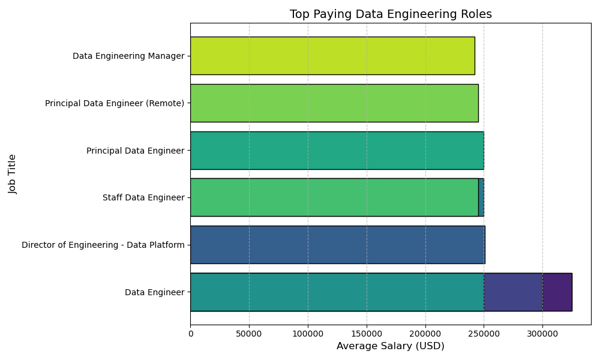

# Introduction
This project analyzes job postings from 2023 to identify key trends in the job market for data engineers. Using SQL, the data was transformed, cleaned, and analyzed to provide insights into top-paying jobs, in-demand skills, and the most financially rewarding skills.

SQL queries? Check them out here: [ Project folder](/Project/).
# Background
In my SQL course, I was introduced to the fascinating world of data engineering and the powerful insights that can be derived from well-structured data. This experience ignited a desire within me to delve deeper into the hidden patterns and trends that lie beneath the surface of raw data. I am particularly interested in uncovering insights that are not immediately visible, leveraging my SQL skills to transform data into meaningful information.

Data comes from my [SQL course](https://lukebarousse.com/sql)

### To achieve this, I have formulated five key questions that will guide my analysis:

1. What are the top-paying data engineer jobs?

2. What skills are required for these top-paying jobs?

3. What skills are most in demand for data engineers?

4. Which skills are associated with higher salaries?

5. What are the most optimal skills to learn based on high salary and demand?

# Tools I Used
To accomplish this project, I harnessed a suite of powerful tools, each bringing unique strengths to the table and they are :-

- **SQL**: Employed for transforming, cleaning, and analyzing the data to extract meaningful insights.

- **PostgreSQL**: Utilized as the database management system to handle and query the datasets.

- **Visual Studio Code**: The code editor used for writing, testing, and debugging SQL queries and scripts.

- **Git & GitHub**: Version control and repository hosting services were used to manage code changes and showcase the project.
# The Analysis
In this section, I dive deep into job postings for data engineers, using my SQL skills to unearth valuable insights. Each step answers key questions about top-paying roles, in-demand skills, and more. Let's explore the data-driven findings that illuminate what makes a data engineering career both rewarding and impactful. 🚀
### 1. Top Paying Data Engineering jobs
To identify the highest_paying roles, I filtered data engineer positions by average yearly salary and location, focusing on remote jobs. This query highlighted the high paying oppertunities in the field.
``` sql
SELECT
    job_title_short,
    job_title,
    salary_year_avg,
    company_dim.name,
    job_location,
    job_schedule_type,
    job_id
FROM 
    job_postings_fact
LEFT JOIN company_dim ON job_postings_fact.company_id=company_dim.company_id

WHERE 
    job_title_short='Data Engineer' AND
    job_work_from_home = TRUE AND
    job_schedule_type= 'Full-time'AND
    salary_year_avg IS NOT NULL

ORDER BY 
    salary_year_avg DESC
LIMIT 10;
```
Unraveling the Top Paying Data Engineering Roles:

In the bustling world of tech, where data engineers are modern-day alchemists, a few roles stand out. Leading the pack, **Data Engineer positions at Engtal** offer a remarkable **$325,000**, promising a lucrative work-from-home opportunity.

**Durlston Partners** follows with $300,000,
while **Twitch’s Director of Engineering** - Data Platform boasts $251,000.

Roles like **Staff Data Engineer and Principal Data Engineer at Signify Technology** and **AI Startup** also promise rewarding salaries around **$250,000**. Companies like **Handshake** and **Movable Ink** add to this elite list, showcasing the high value placed on remote flexibility and competitive compensation.

 **Meta’s Data Engineering Manager** role completes the picture at **$242,000**.

*This classic gradient bar chart highlights the top-paying roles for data engineers in 2023; generated by Microsoft Copilot*

### 2. Skills for Top Paying Jobs
To understand what skills are required for the top-paying jobs, I joined the job postings with the skills data, providing insights into what employers value for high-compensation roles.

``` sql
WITH job_information AS (
SELECT 
    job_title_short,
    job_title,
    salary_year_avg,
    company_dim.name,
    job_id

FROM
    job_postings_fact

LEFT JOIN company_dim ON job_postings_fact.company_id=company_dim.company_id

WHERE
    job_title_short='Data Engineer' AND
    job_work_from_home = TRUE AND 
    job_schedule_type= 'Full-time'AND
    salary_year_avg IS NOT NULL

ORDER BY 
    salary_year_avg DESC
limit 10
)


SELECT
    job_information.*,
    skills_dim.skills
FROM 
    job_information

INNER JOIN skills_job_dim ON job_information.job_id = skills_job_dim.job_id
INNER JOIN skills_dim ON skills_job_dim.skill_id = skills_dim.skill_id
ORDER BY
    salary_year_avg DESC;
```
In the high-stakes world of data engineering, specific skills pave the way to top salaries.

**Python** appears ubiquitously among the highest-paying roles, underscoring its critical importance.

 **Spark and Hadoop** are indispensable for big data processing, essential for senior roles like the Director of Engineering - Data Platform at Twitch.
 
  Mastery of **cloud technologies** such as **Kubernetes and AWS** marks the shift towards cloud-based infrastructures, enhancing the demand for these skills.

  .png)
  *Bar graph visualizing the count of skills for the top 10 paying jobs for data Engineer; Copilot generated this graph from my SQL query results*

### 3. Most In-Demand Skills for Data Engineers
This query helped identify the skills most frequently requested in job postings, directing focus to areas with high demand.
```sql 
SELECT
    count(job_postings_fact.job_id) as number_of_jobs,
    skills_dim.skills
FROM
    job_postings_fact
INNER JOIN
skills_job_dim ON job_postings_fact.job_id = skills_job_dim.job_id
INNER JOIN
skills_dim ON skills_job_dim.skill_id=skills_dim.skill_id
WHERE
    job_title_short='Data Engineer' AND
    job_schedule_type= 'Full-time'AND 
    salary_year_avg IS NOT NULL
GROUP BY 
skills_dim.skills
ORDER BY 
number_of_jobs DESC
limit 5;
```
In the ever-evolving field of data engineering, certain skills stand out as essential. **SQL** takes the lead with 3,052 job listings, cementing its role as a fundamental skill for data engineers. Close on its heels, **Python** is featured in 2,904 listings, demonstrating its versatility and wide applicability. **Cloud technologies** like AWS and Azure are increasingly important, reflecting the shift towards scalable, cloud-based solutions.
### Most In-Demand Skills for Data Engineers

| Skill  | Number of Jobs |
|--------|----------------|
| SQL    | 3,052          |
| Python | 2,904          |
| AWS    | 1,887          |
| Spark  | 1,516          |
| Azure  | 1,378          |

*Table of the demand for the top 5 skills in data Engineer job postings*

### 4. Skills Based on Salary
Exploring the average salaries associated with different skills revealed which skills are the highest paying.

```sql
SELECT
    skills_dim.skills,
    round(avg(salary_year_avg), 0) AS average_skill_salry
FROM
    job_postings_fact
INNER JOIN
skills_job_dim ON job_postings_fact.job_id = skills_job_dim.job_id
INNER JOIN
skills_dim ON skills_job_dim.skill_id=skills_dim.skill_id
WHERE
    salary_year_avg IS NOT NULL
    AND job_title_short = 'Data Engineer'
GROUP BY 
    skills_dim.skills
ORDER BY 
    average_skill_salry DESC
limit 25;
```
Certain specialized skills not only enhance a data engineer's resume but also significantly boost earning potential. **Node.js** tops the list with an impressive average salary of $181,862, highlighting its value in server-side applications. **MongoDB** and **ggplot2** follow closely, underscoring the importance of NoSQL databases and data visualization. Skills like **Solidity** and **Vue.js** also command high salaries, reflecting the integration of blockchain and modern web frameworks in data engineering.

### Highest Paying Skills for Data Engineers

| Skill      | Average Salary (USD) |
|------------|----------------------|
| Node.js    | 181,862              |
| MongoDB    | 179,403              |
| ggplot2    | 176,250              |
| Solidity   | 166,250              |
| Vue.js     | 159,375              |
| CodeCommit | 155,000              |
| Ubuntu     | 154,455              |
| Clojure    | 153,663              |
| Cassandra  | 150,255              |
| Rust       | 147,771              |

*Table of the average salary for the top 10 paying skills for data Engineers*

### 5. Most Optimal Skills to Learn

Combining insights from demand and salary data, this query aimed to pinpoint skills that are both in high demand and have high salaries, offering a strategic focus for skill development.

```sql
SELECT
    skills_dim.skills,
    round(avg(job_postings_fact.salary_year_avg), 0) AS salary,
    count(job_postings_fact.job_id) AS number_of_jobs
FROM
    job_postings_fact
INNER JOIN
    skills_job_dim ON job_postings_fact.job_id = skills_job_dim.job_id
INNER JOIN
   skills_dim ON skills_job_dim.skill_id = skills_dim.skill_id
WHERE
    job_title_short='Data Engineer' AND
    job_work_from_home = TRUE AND 
    salary_year_avg IS NOT NULL
GROUP BY 
    skills_dim.skill_id
Having
    count(skills_job_dim.job_id)>10
ORDER BY 
    salary DESC,
    number_of_jobs DESC
LIMIT 25;
```

#### 1. **High Demand for Cloud and Containerization Skills**: 
Skills such as Kubernetes ($158,190) and Terraform ($146,057) are among the highest-paying,
indicating a strong demand for expertise in cloud infrastructure and container orchestration.
This trend reflects the industry's shift towards cloud-native architectures.

#### 2. **Data Processing and Analysis Tools**:
Tools like Spark ($139,838), PySpark ($139,428), and Pandas ($144,656) are also highly valued.
This suggests that proficiency in data processing frameworks and libraries is crucial for data engineers,
as organizations increasingly rely on big data analytics.

#### 3. **Emerging Technologies**: 
Skills related to streaming data and real-time processing, such as Kafka ($150,549) and Airflow ($138,518), are prominent.
This highlights the growing importance of real-time data processing in modern data engineering roles.

#### 4. **Diverse Database Technologies**: 
The presence of various database technologies, including NoSQL (e.g., MongoDB at $138,569 and Cassandra at $151,282),
indicates a trend towards flexibility in data storage solutions. 
Companies are looking for engineers who can work with both traditional and non-traditional databases.

#### 5. **Programming Languages**: 
Languages like Java ($138,087) and Go ($147,818) are also in demand, 
suggesting that strong programming skills remain essential for data engineering roles.

#### 6. **Machine Learning and AI Integration**: 
Skills related to machine learning frameworks, such as PyTorch ($142,254), are emerging as valuable,
reflecting the integration of AI and machine learning into data engineering tasks.

Overall, the data indicates that data engineering roles are evolving, with a strong emphasis on cloud technologies,
real-time data processing, and a diverse set of programming and database skills. 
This trend suggests that professionals in this field should focus on continuous learning and adaptation to stay competitive. 🚀

### Most Optimal Skills to Learn

| Skill         | Average Salary (USD) | Number of Jobs |
|---------------|----------------------|----------------|
| Kubernetes    | 158,190              | 56             |
| Numpy         | 157,592              | 14             |
| Cassandra     | 151,282              | 19             |
| Kafka         | 150,549              | 134            |
| Golang        | 147,818              | 11             |
| Terraform     | 146,057              | 44             |
| Pandas        | 144,656              | 38             |
| Elasticsearch | 144,102              | 21             |
| Ruby          | 144,000              | 14             |


*Table of the most optimal skills for Data Engineer sorted by salary*
# What I Learned
Throughout this adventure, I've turbocharged my SQL toolkit with some serious firepower:

- **🧩 Complex Query Crafting:** Mastered the art of advanced SQL, merging tables like a pro and wielding WITH clauses for ninja-level temp table maneuvers.
- **📊 Data Aggregation:** Got cozy with GROUP BY and turned aggregate functions like COUNT() and AVG() into my data-summarizing sidekicks.
- **💡 Analytical Wizardry:** Leveled up my real-world puzzle-solving skills, turning questions into actionable, insightful SQL queries.
# Conclusions
### Insights

From the analysis, several general insights emerged:

1. **Top-Paying Data Engineer Jobs**: The highest-paying jobs for data engineers that allow remote work offer significant salaries, with the highest reaching $325,000. These positions include roles at companies like Engtal and Durlston Partners.

2. **Skills for Top-Paying Jobs**: High-paying data engineer jobs require advanced proficiency in multiple skills, with Python being the most frequently mentioned. This indicates that mastering Python is critical for earning a top salary.

3. **Most In-Demand Skills**: SQL leads as the most demanded skill in the data engineering job market, followed closely by Python and cloud technologies like AWS and Azure. This emphasizes their essentiality for job seekers.

4. **Skills with Higher Salaries**: Specialized skills such as Node.js and MongoDB are associated with the highest average salaries, demonstrating a premium on niche expertise. Skills like ggplot2 and Solidity also command high salaries, reflecting their growing importance in data visualization and blockchain technology.

5. **Optimal Skills for Job Market Value**: Skills like Kubernetes and Kafka offer a balance between high salaries and high demand, making them some of the most optimal skills for data engineers to learn to maximize their market value. These skills ensure both financial reward and job security in the ever-evolving tech landscape.

These insights provide a strategic roadmap for data engineers aiming to enhance their skills and career prospects. 🚀
### Closing Thoughts

This project has provided valuable insights into the top-paying roles, demanded skills, and optimal skills for data engineers, showcasing the power of data-driven decision-making. It highlights the importance of continual learning and strategic skill development in maximizing career potential. Thank you for exploring my findings and recognizing the possibilities within the dynamic field of data engineering. 🚀
